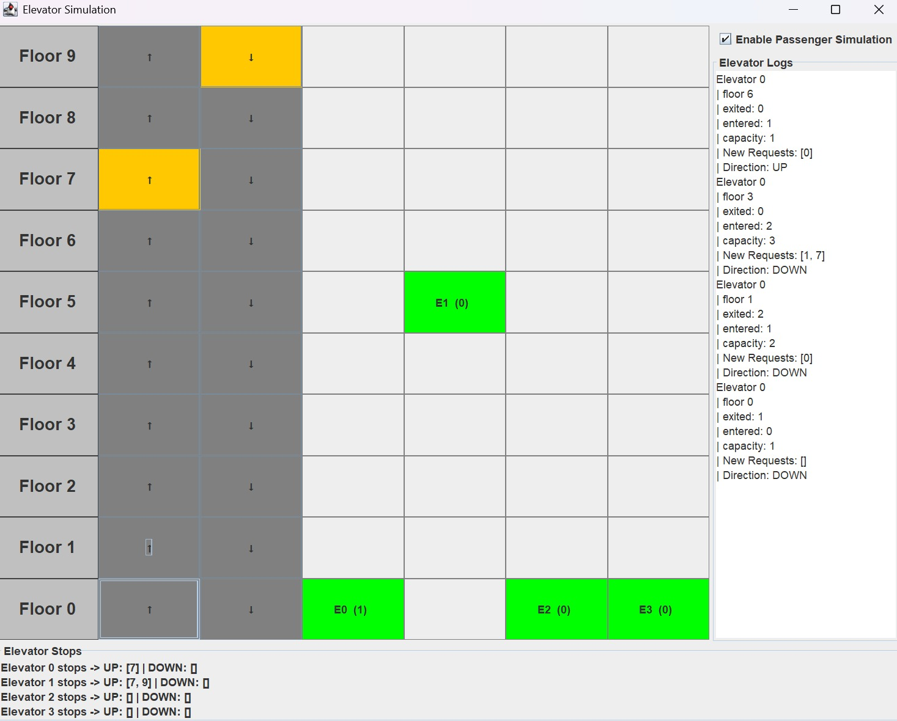

# Elevator-System-Sim

<br/>




## Overview
This project is a **simulation of a multi-elevator control system** implemented in **Java** with a **Swing-based GUI**.

The system models a building with multiple floors and elevators. Each floor contains **Up** and **Down** buttons, and the control system dynamically assigns the most suitable elevator to service incoming requests.

The program demonstrates:

- Event-driven programming
- Basic elevator scheduling algorithms
- Object-oriented system design
- GUI interaction using Swing
- Simulation updates using a timer loop

  ## Program Control flow Overview:

  ```
  main()  
  -> SwingUtilities.invokeLater() starts GUI thread  
  -> start() initializes the simulation  
  -> elevators are created and initialized  
  -> GUI grid and floor buttons are created  
  -> ActionListeners are attached to floor buttons  
  -> Swing Timer is started  

  User presses floor button  
  -> button ActionListener triggers  
  -> requestElevator(floor, direction) is called  
  -> request is added to pendingRequests queue  

  Timer tick (every simulation step)  
  -> update() is executed  
  -> assignElevator() processes pending requests  
  -> best elevator is selected based on distance and direction  
  -> request floor is added to the elevator's stop list  

  update() continues  
  -> each elevator executes move()  
  -> elevator moves one floor in its current direction  
  -> if current floor matches a scheduled stop  
  -> stop is removed from the stop list  

  update() continues  
  -> refreshGUI() updates visual state  
  -> elevator positions are redrawn  
  -> serviced floor buttons reset to normal state  

  Timer repeats  
  -> update() runs again  
  -> system continues simulation

### Passenger Simulation:

- Each elevator stop randomly simulates passengers entering and exiting (0–2 per stop), and new     passengers request random destination floors. The simulation can be toggled on or off via a checkbox in the UI, allowing the elevator system to run deterministically or with stochastic passenger behaviour.

### To Run:

Please head to the [releases](https://github.com/nikhil-RGB/elevator-scheduler-sim/releases/tag/v1.0.0) section.
